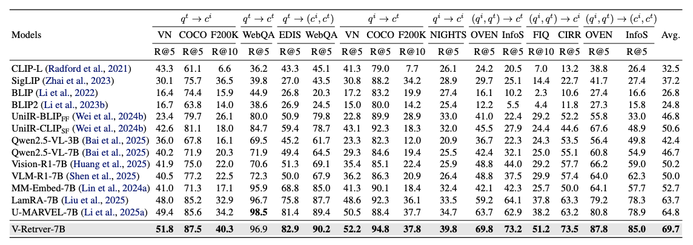
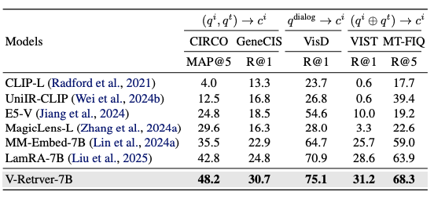
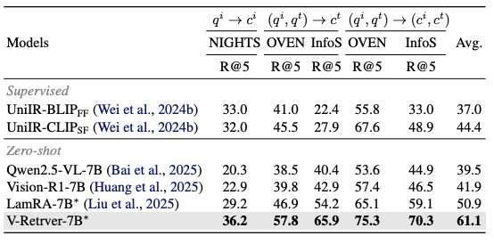

# V-Retrver: Evidence-Driven Agentic Reasoning for Universal Multimodal Retrieval

[[📖 Paper]()] [[🤗 V-Retrver-7B-model]()] [🤗[V-Retrver-RFT-model]()] [🤗[V-Retrver-SFT-model]()] [[🤗 V-Retrver-train-data]()] [🤗 [V-Retrver-eval]()]


## 👀 About OneThinker

<div align="center">
  
</div>

We introduce **V-Retrver**, an evidence-driven retrieval framework that reformulates multimodal retrieval as an agentic reasoning process grounded in visual inspection. V-Retrver enables an MLLM to selectively acquire visual evidence during reasoning via external visual tools, performing a **multimodal interleaved reasoning** process that alternates between hypothesis generation and targeted visual verification. 

To train such an evidence-gathering retrieval agent, we adopt a curriculum-based learning strategy combining **supervised reasoning activation, rejection-based refinement, and reinforcement learning** with an evidence-aligned objective. 

Experiments across multiple multimodal retrieval benchmarks demonstrate consistent improvements in retrieval accuracy **(with 23.0\% improvements on average)**, perception-driven reasoning reliability, and generalization.

All code, models, and data are fully released.


## 🔥 News
- [2025/12/03] We release the code, model, data of V-Retrver

## 📍 Features

+ Support Qwen3-VL/Qwen2.5-VL Training
+ Provide full pipeline (dataset, SFT training, RFT training, RL training, evaluation, etc) 


## 🏆 Performance

V-Retrver-7B demonstrates strong performance across multiple multimodal retrieval benchmarks.


<div align="center">
  
</div>
<div align="center">
  
</div>
<div align="center">
  
</div>


## 🎥 Reasoning Examples

 Some reasoning examples are as follows.

<div align="center">
  
</div>
<div align="center">
  
</div>
<div align="center">
  
</div>


## 📐 Set up

```bash
git clone https://github.com/tulerfeng/OneThinker
cd OneThinker

# build SFT environment
conda create -n llamafactory python=3.11 
conda activate llamafactory
cd LLaMA-Factory
pip install -e ".[torch,metrics]" --no-build-isolation

# build RL environment
conda create -n easyr1 python=3.11 
conda activate easyr1
cd EasyR1
pip install -e .

```

For more details for the SFT and RL environment installation, please refer to [LLaMA-Factory](https://github.com/hiyouga/LLaMA-Factory),  [EasyR1](https://github.com/hiyouga/EasyR1)

Then, download the training datasets [[🤗 OneThinker-train-data](https://huggingface.co/datasets/OneThink/OneThinker-train-data)] and unzip all the data.

The `onethinker_rl_train.json` file is for RL training while `onethinker_sft_image.json` and `onethinker_sft_video.json` is for SFT cold start. The json files end with `_unsampled` are unsampled full set.


## 🚀 Training

For SFT and RL training, a minimum of 8 × 80GB GPUs is required; alternatively, you may reduce the number of frames or the input resolution.

We first perform SFT cold start.

```bash
bash ./LLaMA-Factory/local_scripts/run_onethinker_sft.sh
```
If you want to skip the SFT process, we also provide our SFT model at [🤗[OneThinker-SFT-model](https://huggingface.co/OneThink/OneThinker-SFT-Qwen3-8B)]

Then, we perform RL training  as follows

```bash
bash ./EasyR1/local_scripts/run_onethinker_rl.sh
```

For setting Ray in multi-node training, please refer to [EasyR1](https://github.com/hiyouga/EasyR1), or you may use single-node training by setting `NNODES=1`. Performing RL training for about 200 steps can already yield strong performance.

If you want to use model-based rewards for open-ended problem, please use vllm to lanuch [POLAR-7B](https://github.com/InternLM/POLAR) and revised the setting in `/EasyR1/verl/reward_function/onethinker_reward.py`


## 🔮 Inference & Evaluation
Since OneThinker-8B shares the same architecture as Qwen3-VL-8B, it naturally supports easy and efficient inference.

For the majority of tasks and benchmarks, we recommend using our provided json files and scripts for easier evaluation. 

The json files can be downloaded at: [🤗 [OneThinker-eval](https://huggingface.co/datasets/OneThink/OneThinker-eval)]

Download the trained model [[🤗 OneThinker-8B-model](https://huggingface.co/OneThink/OneThinker-8B)]

Conduct evaluation on all benchmarks using the following scripts

```bash
bash ./Evaluation/Eval/eval_bench_all.sh
```
If you want to perform evaluation on segmentation tasks, please download and install [sam2](https://github.com/facebookresearch/sam2) and revise the related path in `/Evaluation/Eval/seg_post_sam2.py` 

For image QA and part of video QA, we use  [VLMEvalKit](https://github.com/open-compass/VLMEvalKit) for evaluation, please install corresponding environment and run:

```bash
bash ./Evaluation/VLMEvalKit/local_scripts/eval_vlmevalkit.sh
```

For infernce on a single example, you may refer to:

```bash
python ./Evaluation/inference_single/inference.py
```


## Acknowledgements

We sincerely appreciate the contributions of the open-source community. The related projects are as follows: [Video-R1](https://github.com/tulerfeng/Video-R1), [DeepSeek-R1](https://github.com/deepseek-ai/DeepSeek-R1), [EasyR1](https://github.com/hiyouga/EasyR1), [verl](https://github.com/volcengine/verl),  [LLaMA-Factory](https://github.com/hiyouga/LLaMA-Factory),  [sam2](https://github.com/facebookresearch/sam2), [VLMEvalKit](https://github.com/open-compass/VLMEvalKit)

## Citations

If you find our work helpful for your research, please consider citing our work.   

```
@article{feng2025onethinker,
  title={OneThinker: All-in-one Reasoning Model for Image and Video},
  author={Feng, Kaituo and Zhang, Manyuan and Li, Hongyu and Fan, Kaixuan and Chen, Shuang and Jiang, Yilei and Zheng, Dian and Sun, Peiwen and Zhang, Yiyuan and Sun, Haoze and others},
  journal={arXiv preprint arXiv:2512.03043},
  year={2025}
}
```
