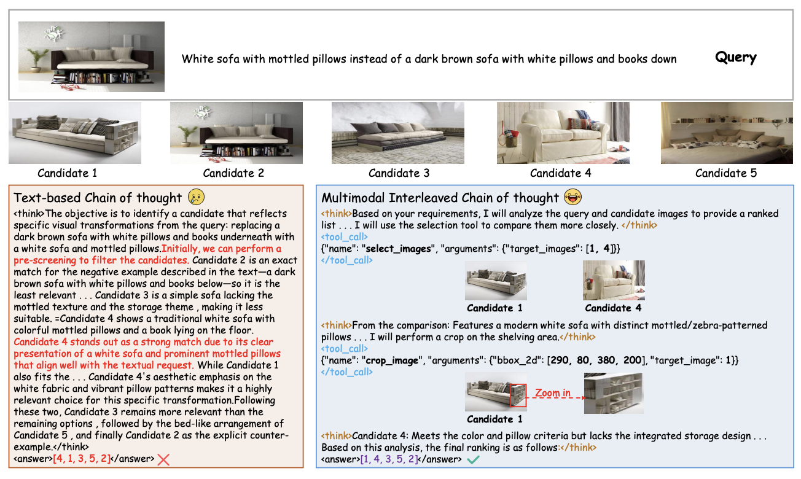
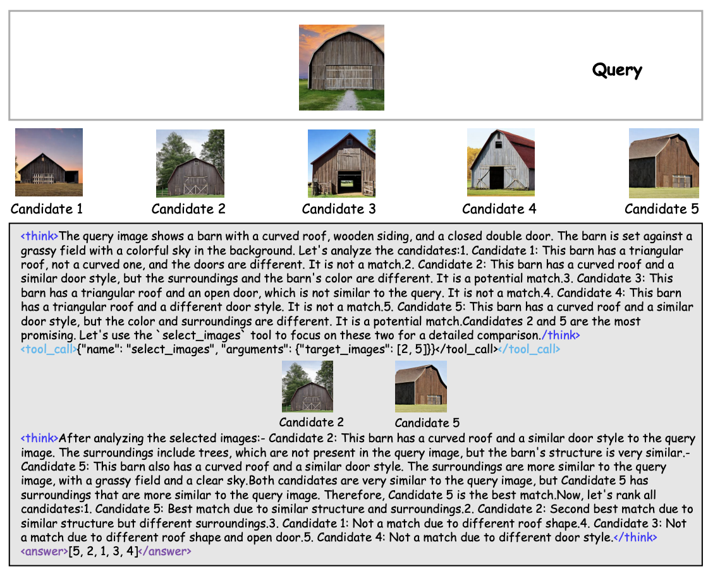
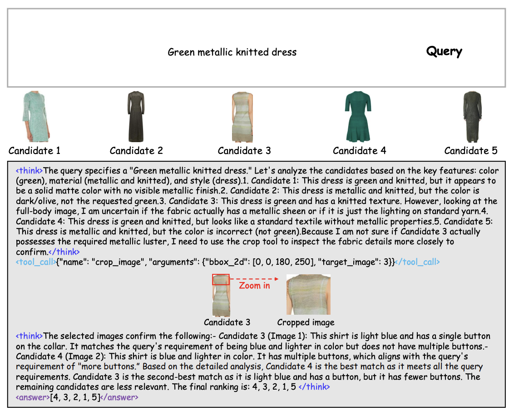
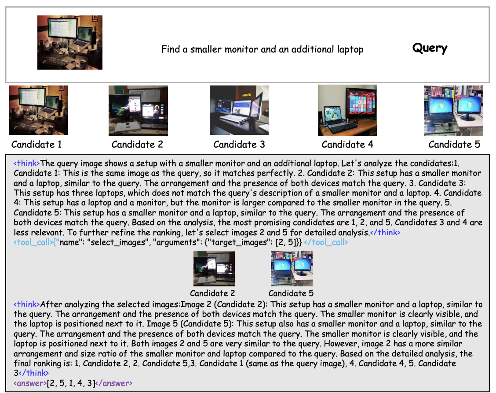

# V-Retrver: Evidence-Driven Agentic Reasoning for Universal Multimodal Retrieval

[[📖 Paper]()] [[🤗 V-Retrver-7B-model]()] [🤗[V-Retrver-RFT-model]()] [🤗[V-Retrver-SFT-model]()] [[🤗 V-Retrver-train-data]()] [🤗 [V-Retrver-eval-data]()]


## 👀 About V-Retrver

<div align="center">
  
</div>

We introduce **V-Retrver**, an evidence-driven retrieval framework that reformulates multimodal retrieval as an agentic reasoning process grounded in visual inspection. V-Retrver enables an MLLM to selectively acquire visual evidence during reasoning via external visual tools, performing a **multimodal interleaved reasoning** process that alternates between hypothesis generation and targeted visual verification. 

To train such an evidence-gathering retrieval agent, we adopt a curriculum-based learning strategy combining **supervised reasoning activation, rejection-based refinement, and reinforcement learning** with an evidence-aligned objective. 

Experiments across multiple multimodal retrieval benchmarks demonstrate consistent improvements in retrieval accuracy **(with 23.0\% improvements on average)**, perception-driven reasoning reliability, and generalization.

All code, models, and data are fully released.


## 🔥 News
- [2026/2/06] We release the code, model, data of V-Retrver

## 📍 Features

+ Support Qwen3-VL/Qwen2.5-VL Training
+ Provide full pipeline (dataset, SFT training, RFT training, RL training, evaluation, etc) 


## 🏆 Performance

V-Retrver-7B demonstrates strong performance across multiple multimodal retrieval benchmarks.


<div align="center">
  
</div>


## 🎥 Reasoning Examples

 Some reasoning examples are as follows.

<div align="center">
  
</div>
<div align="center">
  
</div>
<div align="center">
  
</div>


## 📐 Set up


## 🚀 Training


## 🔮 Inference & Evaluation


## Acknowledgements

We sincerely appreciate the contributions of the open-source community. The related projects are as follows: [verl-tool](https://github.com/TIGER-AI-Lab/verl-tool), [verl](https://github.com/volcengine/verl),  [LLaMA-Factory](https://github.com/hiyouga/LLaMA-Factory), [LamRA](https://github.com/Code-kunkun/LamRA)
## Citations

If you find our work helpful for your research, please consider citing our work.   

```

```
